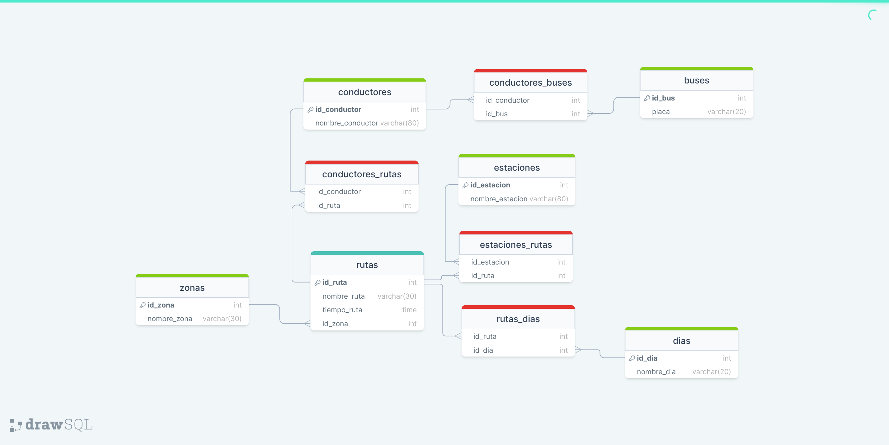

<!DOCTYPE html>
<html lang="en">
<head>
    <meta charset="UTF-8">
    <meta name="viewport" content="width=device-width, initial-scale=1.0">
    <title>Inicio</title>
    
</head>
<body>
    
    <h1>Consultas</h1>
    
1 Cantidad de Paradas por Ruta

    

        

            SELECT DISTINCT  
            r.nombre_ruta,COUNT(re.id_estacion) 
            from rutas_estaciones re 
            inner join rutas r on r.id_ruta=re.id_ruta 
            GROUP BY(r.nombre_ruta); 
        

    

    
2.Nombre de las Paradas de la Ruta Universidades

    

        SELECT DISTINCT 
        estaciones.nombre_estacion 
        from rutas_estaciones 
        inner join rutas on rutas.id_ruta=rutas_estaciones.id_ruta 
        INNER join estaciones on estaciones.id_estacion=rutas_estaciones.id_estacion 
        WHERE rutas.nombre_ruta='Universidades';
    

    
3.Nombres de las Rutas No Programadas

    

        SELECT DISTINCT 
        r.nombre_ruta as 'rutas no programadas' 
        from rutas r 
        WHERE r.id_zona is NULL;
    

    
4.Rutas Programadas sin Conductor Asignado

    

        SELECT DISTINCT 
        r.nombre_ruta as 'rutas sin conductor' 
        from conductores_rutas cr 
        join rutas r on r.id_ruta=cr.id_ruta 
        join conductores c on c.id_conductor=cr.id_conductor 
        WHERE r.id_zona is null;
    

    
5 Conductores No Asignados a la Programación

    

        SELECT DISTINCT 
        c.nombre_conductor as 'nombres conductores no programados' 
        from conductores_rutas cr 
        RIGHT join rutas r on r.id_ruta=cr.id_ruta 
        RIGHT join conductores c on c.id_conductor=cr.id_conductor 
        WHERE r.id_zona is NULL;
    

    
6 Buses No asignados a la Programación

    

        SELECT DISTINCT 
        b.placa as 'bus no programado' 
        from conductores_buses cb 
        RIGHT join buses b on b.id_bus=cb.id_bus 
        LEFT join conductores c on c.id_conductor=cb.id_conductor 
        LEFT join conductores_rutas cr on c.id_conductor=cr.id_conductor 
        LEFT join rutas r on r.id_ruta=cr.id_ruta 
        WHERE r.id_zona is NULL;
    

    
7 Zonas NO Programadas

    

        SELECT DISTINCT 
        z.nombre_zona 
        from zonas z 
        left join rutas r on z.id_zona=r.id_zona 
        WHERE r.id_zona is NULL; 
    

    
8 Programación asignada a cada conductor (Conductor, Ruta y Día).

    

        SELECT DISTINCT 
        c.nombre_conductor as conductor, 
        r.nombre_ruta as ruta, 
        d.nombre_dia as dia 
        from conductores_rutas cr 
        join conductores c on c.id_conductor=cr.id_conductor 
        JOIN rutas r ON r.id_ruta=cr.id_ruta 
        JOIN rutas_dias rd ON r.id_ruta=rd.id_ruta 
        join dias d on d.id_dia=rd.id_dia ;
    

    
9 Programación asignada a conductores que hacen rutas de más de dos horas

    

        SELECT DISTINCT 
        c.nombre_conductor as nombre 
        from conductores_rutas cr 
        join rutas r on r.id_ruta=cr.id_ruta 
        join conductores c on c.id_conductor=cr.id_conductor 
        WHERE r.tiempo_ruta > '2:00';
    

    
10 Nombres de Zonas y cantidad de rutas que tienen programadas (Contar)

    

        SELECT DISTINCT 
        z.nombre_zona as 'nombre zona', 
        COUNT(r.id_ruta) 
        from zonas z 
        join rutas r on z.id_zona=r.id_zona 
        GROUP BY (z.nombre_zona);
    

</body>
</html>